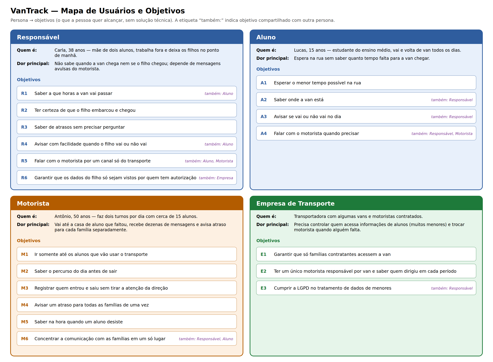

# Mapa de Usuários e Objetivos — VanTrack

O mapa de usuários identifica quem interage com o VanTrack e quais
resultados cada pessoa procura alcançar, a partir do contrato de visão
do produto e das personas.

---

## Contrato de visão

**Problema:** Famílias não sabem quando a van escolar vai passar nem se o aluno chegou. Motoristas perdem tempo indo até alunos que faltaram e avisando cada família separadamente por aplicativos de mensagem.

**Objetivos mensuráveis do MVP**

- Reduzir o tempo de espera do aluno na rua.
- Eliminar deslocamentos até alunos que não vão usar o transporte no dia.
- Avisar embarque, desembarque e atraso a 100% dos responsáveis vinculados, sem ação individual do motorista.

**Escopo do MVP:** vinculação por código da empresa, cadastro de aluno (com autorização para menores), confirmação/cancelamento de presença, rota do dia, acompanhamento da van, embarque/desembarque, avisos de atraso e chat da van.

**Fora do escopo do MVP:** pagamentos e inadimplência, controle de custos (combustível, manutenção), métricas e histórico de pontualidade, painel de monitoramento de frota.

**Restrições:** aplicativo móvel; tratamento de dados de localização e de menores conforme a LGPD; funcionamento com conexão instável.

---

---

## Personas e necessidades

### Responsável — Carla, 38 anos

- **Quem é:** mãe de dois alunos, trabalha fora e deixa os filhos no ponto de manhã.
- **Contexto:** acompanha o transporte pelo celular, entre uma tarefa e outra.
- **Dor principal:** não sabe quando a van chega nem se o filho chegou; depende de mensagens avulsas do motorista.
- **Necessidades:**
  - Quando estou me arrumando para sair, eu quero saber a que horas a van vai passar para levar meu filho ao ponto no momento certo.
  - Quando meu filho entra ou sai da van, eu quero ser avisada para ter certeza de que ele está seguro.
  - Quando a van atrasa, eu quero ser avisada sem precisar perguntar para reorganizar meu horário.
  - Quando meu filho não vai à aula, eu quero avisar com facilidade para que o motorista não passe à toa.

### Aluno — Lucas, 15 anos

- **Quem é:** estudante do ensino médio, usa a van todos os dias.
- **Contexto:** espera no ponto, muitas vezes sozinho.
- **Dor principal:** espera na rua sem saber quanto tempo falta.
- **Necessidades:**
  - Quando estou em casa esperando, eu quero saber que a van está chegando para sair só na hora certa.
  - Quando tenho um imprevisto, eu quero avisar que não vou para que a van não me espere.

### Motorista — Antônio, 50 anos

- **Quem é:** motorista contratado, faz dois turnos com cerca de 15 alunos.
- **Contexto:** passa o dia dirigindo; só consegue usar o celular com a van parada.
- **Dor principal:** vai até a casa de aluno que faltou, recebe dezenas de mensagens e avisa atraso para cada família separadamente.
- **Necessidades:**
  - Quando começo o turno, eu quero saber quais alunos vão para montar o percurso sem paradas desnecessárias.
  - Quando o aluno entra ou sai da van, eu quero registrar isso rapidamente para não tirar a atenção da direção.
  - Quando pego trânsito, eu quero avisar todas as famílias de uma vez para não precisar mandar mensagem uma a uma.
  - Quando um aluno desiste de última hora, eu quero ser avisado na hora para não ir até ele.

### Empresa de Transporte

- **Quem é:** transportadora com algumas vans e motoristas contratados.
- **Contexto:** responde pelas famílias contratantes e pelos dados dos alunos.
- **Dor principal:** precisa controlar quem acessa informações de alunos (muitos menores) e trocar motorista quando alguém falta.
- **Necessidades:**
  - Quando uma família contrata o transporte, eu quero liberar o acesso só à van dela para proteger os dados dos outros alunos.
  - Quando um motorista falta, eu quero colocar outro na van sabendo quem dirigiu em cada período.

---

## Objetivos por persona

| Persona | Código | Objetivo | Compartilhado com |
|---|---|---|---|
| Responsável | R1 | Saber a que horas a van vai passar | Aluno |
| Responsável | R2 | Ter certeza de que o filho embarcou e chegou | — |
| Responsável | R3 | Saber de atrasos sem precisar perguntar | — |
| Responsável | R4 | Avisar com facilidade quando o filho vai ou não vai | Aluno |
| Responsável | R5 | Falar com o motorista por um canal só do transporte | Aluno, Motorista |
| Responsável | R6 | Garantir que os dados do filho só sejam vistos por quem tem autorização | Empresa |
| Aluno | A1 | Esperar o menor tempo possível na rua | — |
| Aluno | A2 | Saber onde a van está | Responsável |
| Aluno | A3 | Avisar se vai ou não vai no dia | Responsável |
| Aluno | A4 | Falar com o motorista quando precisar | Responsável, Motorista |
| Motorista | M1 | Ir somente até os alunos que vão usar o transporte | — |
| Motorista | M2 | Saber o percurso do dia antes de sair | — |
| Motorista | M3 | Registrar quem entrou e saiu sem tirar a atenção da direção | — |
| Motorista | M4 | Avisar um atraso para todas as famílias de uma vez | — |
| Motorista | M5 | Saber na hora quando um aluno desiste | — |
| Motorista | M6 | Concentrar a comunicação com as famílias em um só lugar | Responsável, Aluno |
| Empresa | E1 | Garantir que só famílias contratantes acessem a van | — |
| Empresa | E2 | Ter um único motorista responsável por van e saber quem dirigiu em cada período | — |
| Empresa | E3 | Cumprir a LGPD no tratamento de dados de menores | Responsável |

## Ligação com os requisitos

| Objetivo | Requisitos |
|---|---|
| R1, A1, A2 | RF-002, RF-003 |
| R2 | RF-009, RF-010, RF-011 |
| R3, M4 | RF-012, RF-015 |
| R4, A3, M1, M2 | RF-004, RF-005, RF-007 |
| M5 | RF-006, RF-008 |
| M3 | RF-009, RF-010, RNF-005 |
| R5, A4, M6 | RF-013 |
| R6, E1 | RF-001, RN-002 |
| E2 | RF-014 |
| E3 | RF-016, RN-003, RN-016 |
