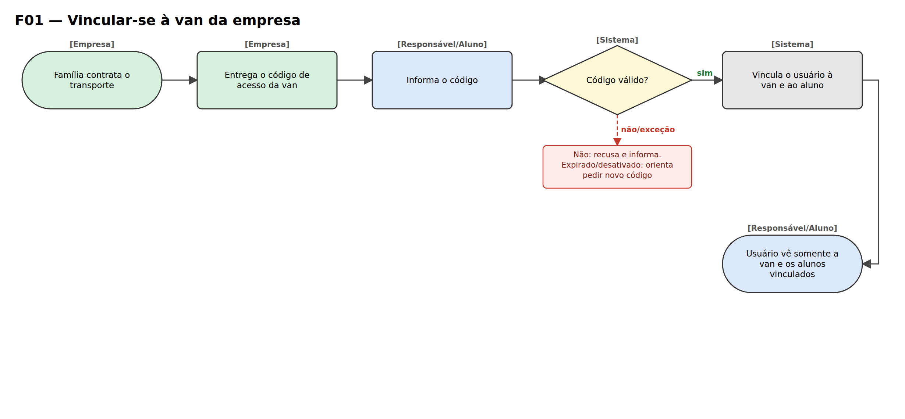
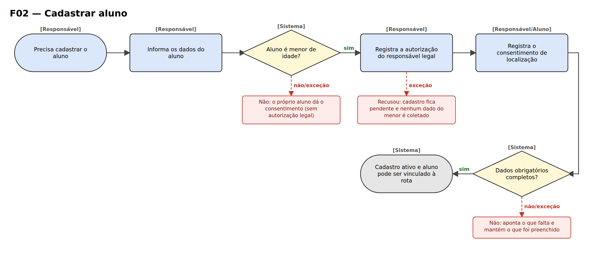
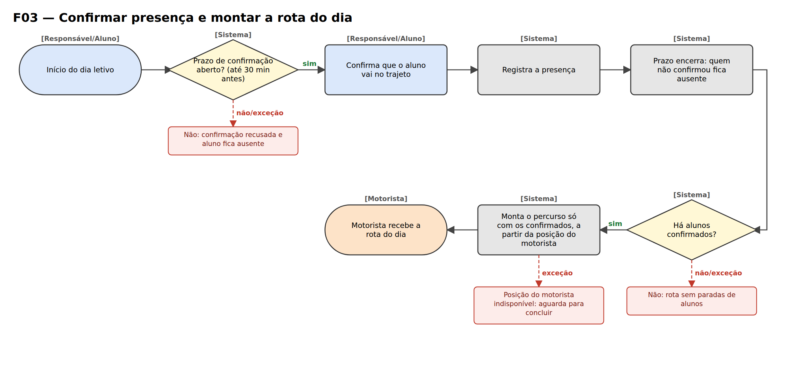
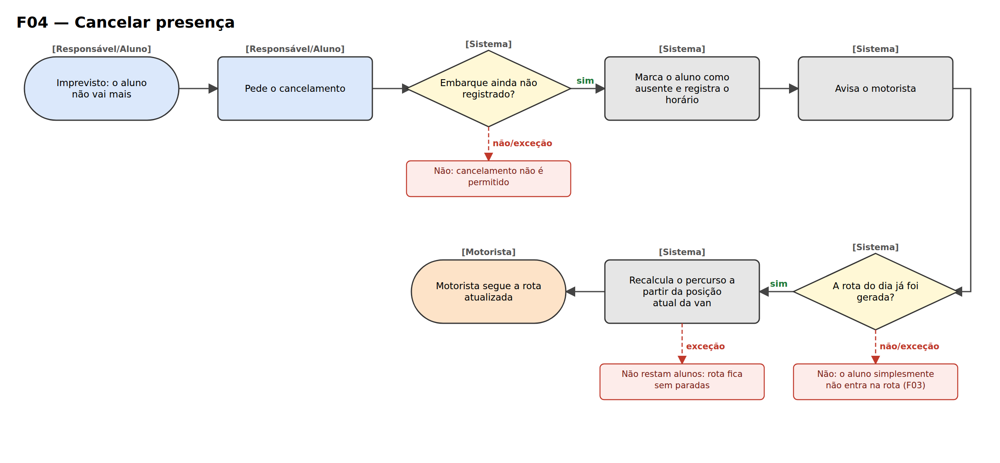
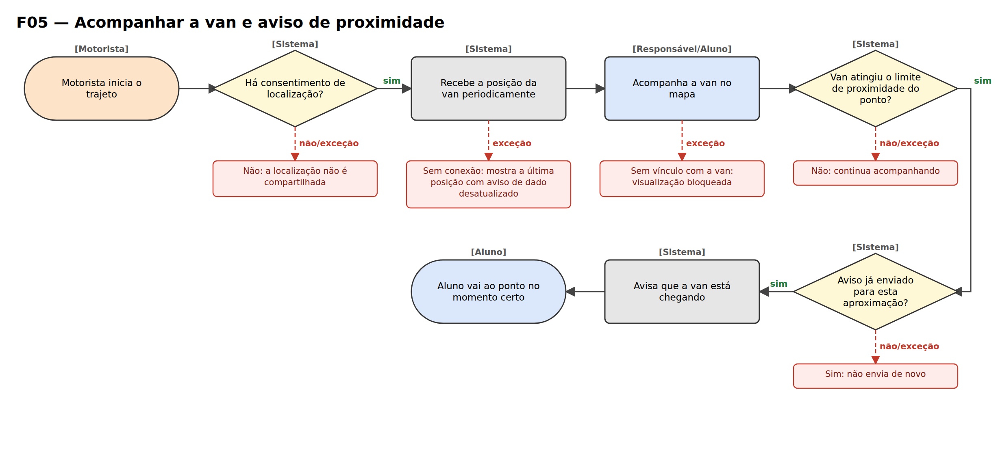
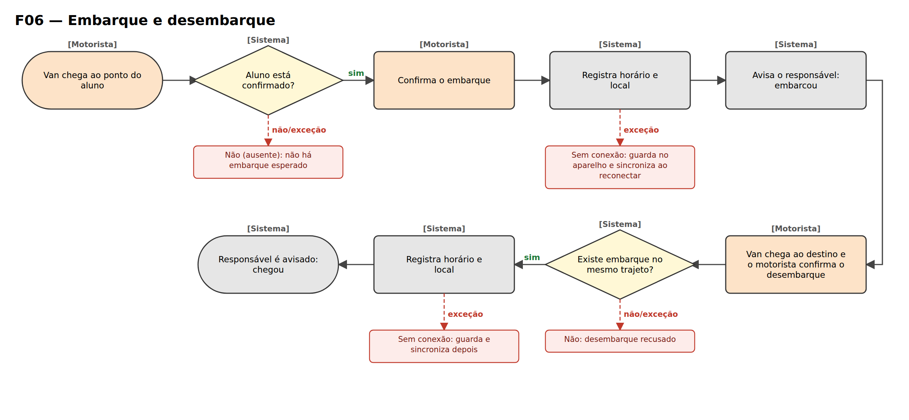
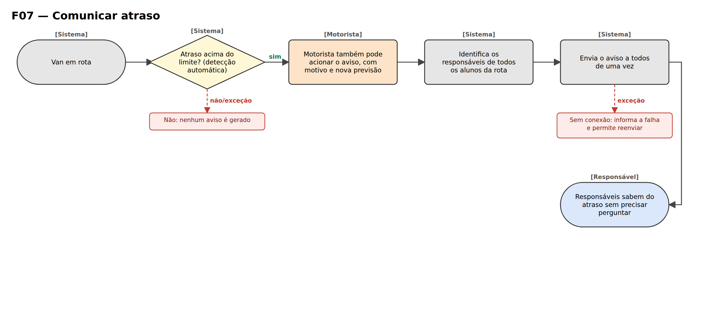
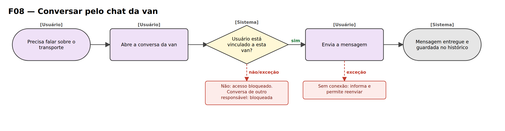
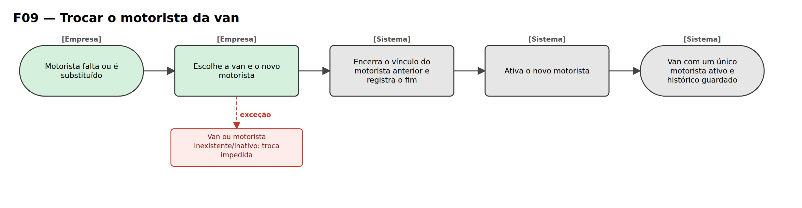

# Mapa de Fluxos — VanTrack

O mapa de fluxos descreve o caminho de cada processo do VanTrack,
indicando quem executa cada passo e as exceções que podem impedir
sua conclusão.

---

**Legenda**

- Entre colchetes, acima de cada passo: **quem executa** (Responsável/Aluno em azul, Motorista em laranja, Sistema em cinza, Empresa em verde).
- Início e fim em formato arredondado; ações em retângulo; decisões em losango (o caminho principal segue pelo **sim**).
- Em vermelho: **exceções** e caminhos alternativos.

| Fluxo | Processo | Requisitos | Regras |
|---|---|---|---|
| F01 | Vincular-se à van da empresa | RF-001 | RN-001, RN-002, RN-009 |
| F02 | Cadastrar aluno | RF-016 | RN-003, RN-009, RN-016 |
| F03 | Confirmar presença e montar a rota do dia | RF-004, RF-007 | RN-004, RN-005, RN-012 |
| F04 | Cancelar presença | RF-005, RF-006, RF-008 | RN-006, RN-007, RN-008 |
| F05 | Acompanhar a van e aviso de proximidade | RF-002, RF-003 | RN-002, RN-003, RN-015 |
| F06 | Embarque e desembarque | RF-009, RF-010, RF-011 | RN-010, RN-011, RN-015 |
| F07 | Comunicar atraso | RF-012, RF-015 | RN-014 |
| F08 | Conversar pelo chat da van | RF-013 | RN-013 |
| F09 | Trocar o motorista da van | RF-014 | RN-012 |

---

## F01 — Vincular-se à van da empresa

**Quem inicia:** Empresa (entrega do código) e Responsável/Aluno  
**Requisitos:** RF-001 · **Regras de negócio:** RN-001, RN-002, RN-009

**Fluxo principal**

1. [Empresa] Família contrata o transporte
2. [Empresa] Entrega o código de acesso da van
3. [Responsável/Aluno] Informa o código
4. [Sistema] Código válido?
5. [Sistema] Vincula o usuário à van e ao aluno
6. [Responsável/Aluno] Usuário vê somente a van e os alunos vinculados

**Exceções**

- Passo 4: Não: recusa e informa. Expirado/desativado: orienta pedir novo código

---

## F02 — Cadastrar aluno

**Quem inicia:** Responsável  
**Requisitos:** RF-016 · **Regras de negócio:** RN-003, RN-009, RN-016

**Fluxo principal**

1. [Responsável] Precisa cadastrar o aluno
2. [Responsável] Informa os dados do aluno
3. [Sistema] Aluno é menor de idade?
4. [Responsável] Registra a autorização do responsável legal
5. [Responsável/Aluno] Registra o consentimento de localização
6. [Sistema] Dados obrigatórios completos?
7. [Sistema] Cadastro ativo e aluno pode ser vinculado à rota

**Exceções**

- Passo 3: Não: o próprio aluno dá o consentimento (sem autorização legal)
- Passo 4: Recusou: cadastro fica pendente e nenhum dado do menor é coletado
- Passo 6: Não: aponta o que falta e mantém o que foi preenchido

---

## F03 — Confirmar presença e montar a rota do dia

**Quem inicia:** Responsável/Aluno → Sistema  
**Requisitos:** RF-004, RF-007 · **Regras de negócio:** RN-004, RN-005, RN-012

**Fluxo principal**

1. [Responsável/Aluno] Início do dia letivo
2. [Sistema] Prazo de confirmação aberto? (até 30 min antes)
3. [Responsável/Aluno] Confirma que o aluno vai no trajeto
4. [Sistema] Registra a presença
5. [Sistema] Prazo encerra: quem não confirmou fica ausente
6. [Sistema] Há alunos confirmados?
7. [Sistema] Monta o percurso só com os confirmados, a partir da posição do motorista
8. [Motorista] Motorista recebe a rota do dia

**Exceções**

- Passo 2: Não: confirmação recusada e aluno fica ausente
- Passo 6: Não: rota sem paradas de alunos
- Passo 7: Posição do motorista indisponível: aguarda para concluir

---

## F04 — Cancelar presença

**Quem inicia:** Responsável/Aluno  
**Requisitos:** RF-005, RF-006, RF-008 · **Regras de negócio:** RN-006, RN-007, RN-008

**Fluxo principal**

1. [Responsável/Aluno] Imprevisto: o aluno não vai mais
2. [Responsável/Aluno] Pede o cancelamento
3. [Sistema] Embarque ainda não registrado?
4. [Sistema] Marca o aluno como ausente e registra o horário
5. [Sistema] Avisa o motorista
6. [Sistema] A rota do dia já foi gerada?
7. [Sistema] Recalcula o percurso a partir da posição atual da van
8. [Motorista] Motorista segue a rota atualizada

**Exceções**

- Passo 3: Não: cancelamento não é permitido
- Passo 6: Não: o aluno simplesmente não entra na rota (F03)
- Passo 7: Não restam alunos: rota fica sem paradas

---

## F05 — Acompanhar a van e aviso de proximidade

**Quem inicia:** Motorista → Sistema  
**Requisitos:** RF-002, RF-003 · **Regras de negócio:** RN-002, RN-003, RN-015

**Fluxo principal**

1. [Motorista] Motorista inicia o trajeto
2. [Sistema] Há consentimento de localização?
3. [Sistema] Recebe a posição da van periodicamente
4. [Responsável/Aluno] Acompanha a van no mapa
5. [Sistema] Van atingiu o limite de proximidade do ponto?
6. [Sistema] Aviso já enviado para esta aproximação?
7. [Sistema] Avisa que a van está chegando
8. [Aluno] Aluno vai ao ponto no momento certo

**Exceções**

- Passo 2: Não: a localização não é compartilhada
- Passo 3: Sem conexão: mostra a última posição com aviso de dado desatualizado
- Passo 4: Sem vínculo com a van: visualização bloqueada
- Passo 5: Não: continua acompanhando
- Passo 6: Sim: não envia de novo

---

## F06 — Embarque e desembarque

**Quem inicia:** Motorista  
**Requisitos:** RF-009, RF-010, RF-011 · **Regras de negócio:** RN-010, RN-011, RN-015

**Fluxo principal**

1. [Motorista] Van chega ao ponto do aluno
2. [Sistema] Aluno está confirmado?
3. [Motorista] Confirma o embarque
4. [Sistema] Registra horário e local
5. [Sistema] Avisa o responsável: embarcou
6. [Motorista] Van chega ao destino e o motorista confirma o desembarque
7. [Sistema] Existe embarque no mesmo trajeto?
8. [Sistema] Registra horário e local
9. [Sistema] Responsável é avisado: chegou

**Exceções**

- Passo 2: Não (ausente): não há embarque esperado
- Passo 4: Sem conexão: guarda no aparelho e sincroniza ao reconectar
- Passo 7: Não: desembarque recusado
- Passo 8: Sem conexão: guarda e sincroniza depois

---

## F07 — Comunicar atraso

**Quem inicia:** Sistema / Motorista  
**Requisitos:** RF-012, RF-015 · **Regras de negócio:** RN-014

**Fluxo principal**

1. [Sistema] Van em rota
2. [Sistema] Atraso acima do limite? (detecção automática)
3. [Motorista] Motorista também pode acionar o aviso, com motivo e nova previsão
4. [Sistema] Identifica os responsáveis de todos os alunos da rota
5. [Sistema] Envia o aviso a todos de uma vez
6. [Responsável] Responsáveis sabem do atraso sem precisar perguntar

**Exceções**

- Passo 2: Não: nenhum aviso é gerado
- Passo 5: Sem conexão: informa a falha e permite reenviar

---

## F08 — Conversar pelo chat da van

**Quem inicia:** Usuário (motorista, responsável ou aluno)  
**Requisitos:** RF-013 · **Regras de negócio:** RN-013

**Fluxo principal**

1. [Usuário] Precisa falar sobre o transporte
2. [Usuário] Abre a conversa da van
3. [Sistema] Usuário está vinculado a esta van?
4. [Usuário] Envia a mensagem
5. [Sistema] Mensagem entregue e guardada no histórico

**Exceções**

- Passo 3: Não: acesso bloqueado. Conversa de outro responsável: bloqueada
- Passo 4: Sem conexão: informa e permite reenviar

---

## F09 — Trocar o motorista da van

**Quem inicia:** Empresa  
**Requisitos:** RF-014 · **Regras de negócio:** RN-012

**Fluxo principal**

1. [Empresa] Motorista falta ou é substituído
2. [Empresa] Escolhe a van e o novo motorista
3. [Sistema] Encerra o vínculo do motorista anterior e registra o fim
4. [Sistema] Ativa o novo motorista
5. [Sistema] Van com um único motorista ativo e histórico guardado

**Exceções**

- Passo 2: Van ou motorista inexistente/inativo: troca impedida
