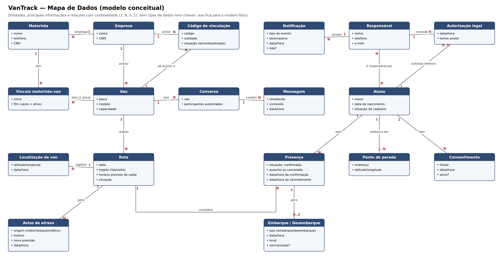

# Mapa de Dados — VanTrack

O mapa de dados apresenta as entidades do VanTrack e as relações entre
elas, escritas em linguagem natural e representadas em um diagrama
conceitual com as cardinalidades.

---

---

## 1. Relações em linguagem natural

### Empresa, vans e motoristas

- Uma **Empresa** possui muitas **Vans**.
- Uma **Empresa** emprega muitos **Motoristas**.
- Uma **Empresa** emite muitos **Códigos de vinculação**, e cada código dá acesso a uma **Van**.
- Uma **Van** tem muitos **Vínculos de motorista** ao longo do tempo, mas **apenas um ativo por vez**.
- Um **Motorista** pode ter muitos **Vínculos** (histórico de quais vans dirigiu e quando).

### Famílias e alunos

- Um **Responsável** pode ser responsável por muitos **Alunos**, e um **Aluno** pode ter muitos **Responsáveis**.
- Um **Aluno menor de idade** deve ter pelo menos um **Responsável** vinculado.
- Um **Aluno menor de idade** tem uma **Autorização legal**, concedida por um **Responsável**.
- Um **Aluno** tem um ou mais **Consentimentos** para uso da localização.
- Um **Aluno** embarca em um ou mais **Pontos de parada** (por exemplo, um na ida e outro na volta).

### Operação diária

- Uma **Van** realiza muitas **Rotas** (uma por dia e por trajeto: ida ou volta).
- Uma **Rota** passa por muitos **Pontos de parada**, em uma ordem definida.
- Um **Aluno** tem muitas **Presenças**, e cada **Presença** é de um aluno em uma **Rota**.
- Uma **Presença** confirmada gera no máximo um **Embarque** e um **Desembarque**. Só existe desembarque se houve embarque na mesma rota.
- Uma **Rota** registra muitas **Localizações da van** durante o trajeto.
- Uma **Rota** pode gerar muitos **Avisos de atraso** (manuais ou automáticos).

### Comunicação

- Um **Usuário** (responsável, aluno ou motorista) recebe muitas **Notificações**; cada notificação se refere a um evento (proximidade, embarque, desembarque, atraso ou cancelamento).
- Uma **Van** tem uma ou mais **Conversas**, das quais participam o motorista e os responsáveis/alunos vinculados.
- Uma **Conversa** contém muitas **Mensagens**, cada uma enviada por um participante.

---

## 2. Diagrama conceitual

---

## 3. Entidades e principais informações

| Entidade | Principais informações | Por que existe |
|---|---|---|
| Empresa | nome, CNPJ | Dona das vans e emissora dos códigos (RN-001). |
| Código de vinculação | código, validade, situação | Controla o acesso à van (RF-001). |
| Van | placa, modelo, capacidade | Veículo acompanhado pelas famílias. |
| Motorista | nome, telefone, CNH | Opera a van e registra embarques. |
| Vínculo motorista–van | início, fim | Garante um motorista ativo por vez e guarda o histórico (RN-012, RF-014). |
| Responsável | nome, telefone, e-mail | Acompanha o aluno e recebe os avisos. |
| Aluno | nome, data de nascimento, situação do cadastro | A data de nascimento define se é menor (RN-009, RN-016). |
| Autorização legal | data/hora, termo aceito | Exigida para ativar aluno menor (RN-016). |
| Consentimento | titular, data/hora, ativo? | Sem ele a localização não é compartilhada (RN-003). |
| Ponto de parada | endereço, latitude/longitude | Onde o aluno embarca/desembarca. |
| Rota | data, trajeto (ida/volta), horário previsto, situação | Percurso do dia, montado com os confirmados (RN-005). |
| Presença | situação, data/hora da confirmação, data/hora do cancelamento | Define quem entra na rota e respeita o prazo (RN-004, RN-006). |
| Embarque / Desembarque | tipo, data/hora, local, sincronizado? | Registro do motorista, inclusive sem conexão (RN-010, RN-011, RN-015). |
| Localização da van | latitude/longitude, data/hora | Acompanhamento em tempo real e aviso de proximidade (RF-002, RF-003). |
| Aviso de atraso | origem, motivo, nova previsão, data/hora | Comunicação única a todos os responsáveis (RN-014). |
| Notificação | tipo do evento, destinatário, data/hora, lida? | Evita avisos duplicados e registra o que foi comunicado. |
| Conversa | van, participantes autorizados | Restringe o chat aos vinculados à van (RN-013). |
| Mensagem | remetente, conteúdo, data/hora | Histórico do chat (RF-013). |

---

## 4. O que mudou em relação à versão anterior

| Antes | Agora | Motivo |
|---|---|---|
| Modelo físico (PK, FK, Varchar) | Modelo conceitual com relações em frases | A etapa pede entidades e relações em linguagem natural. |
| Aluno com um único responsável | Responsável N:N Aluno | Um aluno pode ter mais de um responsável (RF-011, RN-009). |
| Van guardava só o motorista atual | Vínculo motorista–van com início e fim | Histórico de motoristas (RF-014, RN-012). |
| Sem código de vinculação | Entidade Código de vinculação | Acesso só por código da empresa (RF-001, RN-001). |
| Sem consentimento e autorização | Entidades Consentimento e Autorização legal | LGPD e dados de menores (RN-003, RN-016). |
| Check-in sem rota | Embarque/Desembarque ligado à Presença, que pertence a uma Rota | Desembarque só com embarque no mesmo trajeto (RN-011). |
| Presença só com data e status | Presença com trajeto e horários de confirmação/cancelamento | Prazo de 30 minutos e cancelamento (RN-004, RN-006). |
| Notificação só para responsável | Notificação para qualquer usuário | O motorista também é avisado (RF-006). |
| Chat sem ligação com a van | Conversa pertence a uma Van | Acesso restrito por vínculo (RN-013). |
