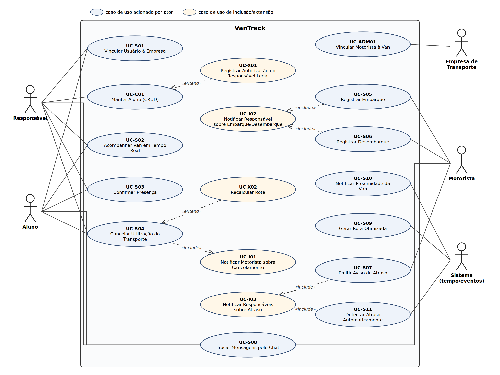

# Casos de Uso — VanTrack

Este documento descreve como os atores do VanTrack interagem com o sistema
para atingir seus objetivos. Os casos de uso estão organizados por tipo,
seguindo o modelo da disciplina, e cada um está ligado aos requisitos
funcionais (RF), às regras de negócio (RN) e aos requisitos não funcionais
(RNF) definidos na [Atividade 02](../atividade-02/).

| Prefixo | Tipo de caso de uso | O que descreve |
|---|---|---|
| UC-B | Negócio | O processo do negócio (transporte escolar), independente do software. |
| UC-S | Sistema | A interação entre ator e sistema para atingir um objetivo. |
| UC-E | Essencial | A intenção do ator e a responsabilidade do sistema, sem detalhes de tecnologia ou tela. |
| UC-R | Real | A interação concreta com a interface (telas, botões, mensagens). |
| UC-A | Abstrato | Um padrão reaproveitável que não é executado sozinho. |
| UC-C | Concreto / CRUD | Cadastro e manutenção de uma entidade. |
| UC-I | `<<include>>` | Comportamento obrigatório reaproveitado por outros casos de uso. |
| UC-X | `<<extend>>` | Comportamento opcional que só ocorre sob uma condição. |
| UC-ADM | Administrativo | Configuração e gestão feitas pela empresa de transporte. |

---

## 1. Atores

| Ator | Tipo | Descrição |
|---|---|---|
| Responsável | Principal | Responsável legal pelo aluno. Acompanha a van, confirma/cancela presença, recebe notificações e cadastra alunos menores. |
| Aluno | Principal | Usuário do transporte. Pode confirmar/cancelar a própria presença e acompanhar a van. |
| Motorista | Principal | Opera a van, executa a rota, registra embarque/desembarque e comunica atrasos. |
| Empresa de Transporte | Principal | Fornece os códigos de vinculação e gerencia o vínculo motorista–van. |
| Sistema (tempo/eventos) | Principal (automático) | Executa comportamentos disparados por horário ou por eventos (gerar rota, detectar atraso, notificar). |
| Serviço de Geolocalização (GPS/Mapas) | Secundário | Fornece a localização da van e o cálculo de trajetos. |
| Serviço de Notificação (push) | Secundário | Entrega as notificações aos dispositivos dos usuários. |

> Um mesmo usuário pode assumir mais de um papel (ex.: o aluno maior de idade que é responsável por si mesmo).

---

## 2. Lista de casos de uso

| ID | Caso de uso | Tipo | Ator principal | RF |
|---|---|---|---|---|
| UC-B01 | Realizar Transporte Escolar Diário | Negócio | Motorista (papel de negócio) | RF-004 a RF-012 |
| UC-B02 | Aderir ao Transporte da Empresa | Negócio | Responsável (papel de negócio) | RF-001, RF-016 |
| UC-S01 | Vincular Usuário à Empresa | Sistema | Responsável/Aluno | RF-001 |
| UC-S02 | Acompanhar Van em Tempo Real | Sistema | Responsável/Aluno | RF-002 |
| UC-S03 | Confirmar Presença | Sistema | Responsável/Aluno | RF-004 |
| UC-S04 | Cancelar Utilização do Transporte | Sistema | Responsável/Aluno | RF-005 |
| UC-S05 | Registrar Embarque | Sistema | Motorista | RF-009 |
| UC-S06 | Registrar Desembarque | Sistema | Motorista | RF-010 |
| UC-S07 | Emitir Aviso de Atraso | Sistema | Motorista | RF-012 |
| UC-S08 | Trocar Mensagens pelo Chat | Sistema | Motorista/Responsável/Aluno | RF-013 |
| UC-S09 | Gerar Rota Otimizada | Sistema (automático) | Sistema | RF-007 |
| UC-S10 | Notificar Proximidade da Van | Sistema (automático) | Sistema | RF-003 |
| UC-S11 | Detectar Atraso Automaticamente | Sistema (automático) | Sistema | RF-015 |
| UC-E01 | Confirmar Utilização do Transporte | Essencial | Responsável/Aluno | RF-004 |
| UC-E02 | Registrar Movimentação do Aluno | Essencial | Motorista | RF-009, RF-010 |
| UC-R01 | Confirmar Presença pelo Aplicativo | Real | Responsável/Aluno | RF-004 |
| UC-R02 | Registrar Embarque pela Tela da Rota | Real | Motorista | RF-009 |
| UC-A01 | Manter Cadastro Base | Abstrato | Usuário | — |
| UC-C01 | Manter Aluno | Concreto / CRUD | Responsável | RF-016 |
| UC-I01 | Notificar Motorista sobre Cancelamento | `<<include>>` de UC-S04 | Sistema | RF-006 |
| UC-I02 | Notificar Responsável sobre Embarque/Desembarque | `<<include>>` de UC-S05 e UC-S06 | Sistema | RF-011 |
| UC-I03 | Notificar Responsáveis sobre Atraso | `<<include>>` de UC-S07 e UC-S11 | Sistema | RF-012, RF-015 |
| UC-X01 | Registrar Autorização do Responsável Legal | `<<extend>>` de UC-C01 | Responsável | RF-016 |
| UC-X02 | Recalcular Rota | `<<extend>>` de UC-S04 | Sistema | RF-008 |
| UC-ADM01 | Vincular Motorista à Van | Administrativo | Empresa de Transporte | RF-014 |

---

## 3. Diagrama de casos de uso

O diagrama mostra a visão de sistema (UC-S, UC-C, UC-I, UC-X e UC-ADM).
Os casos de uso de negócio, essenciais e reais são outras visões dos mesmos
objetivos e por isso não aparecem como elementos separados no diagrama.

**Justificativa dos relacionamentos**

- **`<<include>>`** foi usado apenas onde o comportamento é **obrigatório e reaproveitado**:
  - todo cancelamento válido avisa o motorista (UC-I01, RN-007);
  - toda confirmação de embarque/desembarque gera aviso ao responsável (UC-I02);
  - o envio do aviso de atraso é o mesmo seja manual (UC-S07) ou automático (UC-S11), então fica em UC-I03.
- **`<<extend>>`** foi usado onde o comportamento é **opcional e depende de uma condição**:
  - a autorização do responsável legal só ocorre quando o aluno é menor de idade (UC-X01, RN-016);
  - o recálculo só ocorre se a rota do dia já tiver sido gerada (UC-X02, RN-008).

---

## 4. Casos de uso de negócio

### UC-B01 — Realizar Transporte Escolar Diário (Caso de Uso de Negócio)

**Objetivo:** Descrever o processo do negócio de levar os alunos até a escola (ou de volta) em um dia de operação.

**Ator principal:** Motorista (papel de negócio)

**Atores secundários:** Responsável/Aluno, Empresa de Transporte

**Pré-condições:** Aluno contratado pela empresa; van com motorista designado.

**Pós-condições:** Alunos transportados e responsáveis informados sobre embarque e desembarque.

**Gatilho:** Início do dia letivo / horário do trajeto.

**Fluxo principal (sucesso)**

1. Responsável ou aluno informa se o aluno vai utilizar o transporte no dia.
2. Motorista organiza o percurso somente com os alunos que vão utilizar o transporte.
3. Motorista inicia o trajeto.
4. Responsáveis acompanham a aproximação da van.
5. Motorista busca cada aluno no ponto de parada e confirma o embarque.
6. Responsável é avisado de que o aluno embarcou.
7. Motorista leva os alunos ao destino e confirma o desembarque.
8. Responsável é avisado de que o aluno chegou.

**Fluxos alternativos**

- **A1. (Imprevisto do aluno)** Após o passo 1 e antes do embarque, responsável/aluno informa que o aluno não vai mais → motorista é avisado e retira o ponto do percurso.
- **A2. (Atraso da van)** Durante os passos 3 a 7, motorista comunica o atraso a todos os responsáveis da rota de uma só vez.

**Regras de negócio**

- RN-004: A confirmação deve ocorrer até 30 minutos antes da saída.
- RN-005: O percurso considera apenas os alunos confirmados.
- RN-006: O cancelamento só é aceito antes do embarque.
- RN-010: Todo embarque e desembarque deve ser confirmado pelo motorista.
- RN-011: Só existe desembarque se houve embarque no mesmo trajeto.
- RN-014: Atrasos são comunicados a todos os responsáveis da rota.

**Requisitos relacionados:** RF-004 a RF-012

---

### UC-B02 — Aderir ao Transporte da Empresa (Caso de Uso de Negócio)

**Objetivo:** Descrever o processo do negócio pelo qual uma família passa a ter acesso às informações do transporte do aluno.

**Ator principal:** Responsável (papel de negócio)

**Atores secundários:** Empresa de Transporte

**Pré-condições:** Família contratou o transporte com a empresa.

**Pós-condições:** Responsável e aluno com acesso somente às informações da van contratada.

**Gatilho:** Contratação do transporte.

**Fluxo principal (sucesso)**

1. Empresa entrega ao responsável um código de acesso da van.
2. Responsável registra os dados do aluno.
3. Responsável autoriza o uso dos dados e da localização do aluno.
4. Responsável utiliza o código para se vincular à van.
5. Empresa passa a considerar o aluno na operação da van.

**Fluxos alternativos**

- **A1. (Aluno maior de idade)** No passo 3, o próprio aluno dá o consentimento, sem autorização de responsável legal.
- **A2. (Código inválido ou expirado)** No passo 4, o responsável solicita novo código à empresa.

**Regras de negócio**

- RN-001: O acesso só ocorre com código fornecido pela empresa.
- RN-003: A localização só é usada com consentimento registrado.
- RN-009: Aluno menor precisa de ao menos um responsável vinculado.
- RN-016: Cadastro de menor exige autorização do responsável legal.

**Requisitos relacionados:** RF-001, RF-016

---

## 5. Casos de uso de sistema

### UC-S01 — Vincular Usuário à Empresa (Caso de Uso de Sistema)

**Objetivo:** Permitir que o usuário acesse a van, a rota e os alunos autorizados por meio de um código fornecido pela empresa de transporte.

**Ator principal:** Responsável ou Aluno

**Atores secundários:** Empresa de Transporte (emissora do código)

**Pré-condições:** Usuário cadastrado e autenticado no sistema.

**Pós-condições:** Usuário vinculado à empresa, van e/ou aluno correspondente, com acesso somente aos dados autorizados.

**Gatilho:** Usuário escolhe "Vincular à empresa" (primeiro acesso ou novo vínculo).

**Fluxo principal (sucesso)**

1. Sistema solicita o código de vinculação.
2. Usuário informa o código fornecido pela empresa.
3. Sistema valida o código.
4. Sistema identifica a empresa, a van e/ou o aluno associados ao código.
5. Sistema registra o vínculo do usuário.
6. Sistema exibe a van/rota vinculada e libera as funcionalidades correspondentes.

**Fluxos alternativos**

- **A1. (Responsável com mais de um aluno)** No passo 4, o código se refere a outro aluno do mesmo responsável → sistema adiciona o novo aluno à conta, mantendo os vínculos anteriores, e segue para o passo 5.

**Exceções**

- **E1. Código inválido** → sistema recusa a vinculação, informa o erro e volta ao passo 1.
- **E2. Código expirado ou desativado** → sistema informa a situação e orienta o usuário a solicitar novo código à empresa.

**Regras de negócio:** RN-001, RN-002, RN-009

**Requisitos relacionados:** RF-001, RNF-002, RNF-004

---

### UC-S02 — Acompanhar Van em Tempo Real (Caso de Uso de Sistema)

**Objetivo:** Permitir que o responsável ou aluno veja no mapa a localização atual da van.

**Ator principal:** Responsável ou Aluno

**Atores secundários:** Motorista (dispositivo que envia a posição), Serviço de Geolocalização

**Pré-condições:** Usuário vinculado à van/rota (UC-S01); consentimento de localização registrado; van em operação.

**Pós-condições:** Última localização recebida registrada e exibida ao usuário autorizado.

**Gatilho:** Usuário abre a tela "Acompanhar van".

**Fluxo principal (sucesso)**

1. Usuário seleciona o aluno/van que deseja acompanhar.
2. Sistema verifica se o usuário tem vínculo com a van.
3. Sistema obtém a localização atual da van.
4. Sistema exibe a van no mapa, com o ponto de parada do aluno.
5. Sistema atualiza a posição periodicamente, conforme o intervalo definido no RNF-001.

**Fluxos alternativos**

- **A1. (Van ainda não iniciou a rota)** No passo 3, a van não está em operação → sistema informa que a rota ainda não foi iniciada.

**Exceções**

- **E1. Perda de conectividade** → sistema exibe a última localização conhecida com aviso claro de que o dado pode estar desatualizado, informando o horário da última atualização.
- **E2. Usuário sem vínculo com a van** → sistema bloqueia a visualização.

**Regras de negócio:** RN-002, RN-003, RN-012, RN-015

**Requisitos relacionados:** RF-002, RNF-001, RNF-002, RNF-003

---

### UC-S03 — Confirmar Presença (Caso de Uso de Sistema)

**Objetivo:** Informar que o aluno utilizará o transporte no dia, para que ele seja incluído na rota.

**Ator principal:** Responsável ou Aluno

**Atores secundários:** Motorista (beneficiado pela informação)

**Pré-condições:** Aluno vinculado a uma rota; prazo de confirmação aberto (até 30 minutos antes do horário previsto de saída).

**Pós-condições:** Presença registrada; aluno considerado na geração da rota do dia.

**Gatilho:** Usuário escolhe "Confirmar presença".

**Fluxo principal (sucesso)**

1. Sistema exibe os alunos vinculados e as datas/trajetos disponíveis.
2. Usuário seleciona o aluno e o dia/trajeto.
3. Sistema verifica se o prazo de confirmação ainda está aberto.
4. Usuário confirma a presença.
5. Sistema registra a presença com data e horário.
6. Sistema exibe o status "Presença confirmada".

**Fluxos alternativos**

- **A1. (Presença já confirmada)** No passo 2, o aluno já está confirmado → sistema exibe o status atual e oferece a opção de cancelar (UC-S04).

**Exceções**

- **E1. Prazo encerrado** → sistema informa que o prazo terminou; o aluno sem confirmação permanece ausente.

**Regras de negócio:** RN-004, RN-005

**Requisitos relacionados:** RF-004, RNF-002

---

### UC-S04 — Cancelar Utilização do Transporte (Caso de Uso de Sistema)

**Objetivo:** Cancelar uma presença já confirmada para refletir imprevistos na operação da rota.

**Ator principal:** Responsável ou Aluno

**Atores secundários:** Motorista

**Pré-condições:** Presença previamente confirmada; embarque ainda não registrado.

**Pós-condições:** Aluno marcado como ausente, com data e horário do cancelamento; motorista notificado.

**Gatilho:** Usuário escolhe "Cancelar presença".

**Fluxo principal (sucesso)**

1. Usuário seleciona o aluno e o trajeto com presença confirmada.
2. Sistema verifica se o embarque ainda não foi registrado.
3. Sistema pede a confirmação do cancelamento.
4. Usuário confirma.
5. Sistema altera o status do aluno para ausente e registra data e horário.
6. Sistema executa **UC-I01 — Notificar Motorista sobre Cancelamento** (`<<include>>`).
7. Sistema exibe o status "Presença cancelada".

**Ponto de extensão:** Após o passo 5, se a rota do dia já tiver sido gerada, executa **UC-X02 — Recalcular Rota**.

**Exceções**

- **E1. Embarque já registrado** → sistema não permite o cancelamento e informa o motivo.

**Regras de negócio:** RN-006, RN-007, RN-008

**Requisitos relacionados:** RF-005, RNF-002

---

### UC-S05 — Registrar Embarque (Caso de Uso de Sistema)

**Objetivo:** Registrar que o aluno entrou na van.

**Ator principal:** Motorista

**Atores secundários:** Responsável (recebe o aviso)

**Pré-condições:** Rota ativa; aluno com presença confirmada.

**Pós-condições:** Aluno marcado como embarcado, com data, horário e localização (quando disponível); responsável notificado.

**Gatilho:** Aluno entra na van.

**Fluxo principal (sucesso)**

1. Sistema exibe a lista de alunos confirmados na ordem da rota.
2. Motorista seleciona o aluno e confirma o embarque.
3. Sistema registra o embarque com data, horário e localização.
4. Sistema altera o status do aluno para "embarcado".
5. Sistema executa **UC-I02 — Notificar Responsável sobre Embarque/Desembarque** (`<<include>>`).

**Fluxos alternativos**

- **A1. (Sem conectividade)** No passo 3 → o registro é armazenado localmente no dispositivo do motorista, sem bloquear a ação, e sincronizado automaticamente ao reconectar; a notificação (passo 5) é enviada após a sincronização.

**Exceções**

- **E1. Aluno ausente** → sistema não exibe o aluno como embarque esperado.

**Regras de negócio:** RN-010, RN-015

**Requisitos relacionados:** RF-009, RNF-005, RNF-006

---

### UC-S06 — Registrar Desembarque (Caso de Uso de Sistema)

**Objetivo:** Registrar a chegada do aluno ao destino.

**Ator principal:** Motorista

**Atores secundários:** Responsável (recebe o aviso)

**Pré-condições:** Embarque registrado para o mesmo trajeto.

**Pós-condições:** Aluno marcado como desembarcado, com data, horário e localização (quando disponível); responsável notificado.

**Gatilho:** Aluno desce da van.

**Fluxo principal (sucesso)**

1. Sistema exibe a lista de alunos embarcados.
2. Motorista seleciona o aluno e confirma o desembarque.
3. Sistema verifica se existe embarque registrado no mesmo trajeto.
4. Sistema registra o desembarque com data, horário e localização.
5. Sistema altera o status do aluno para "desembarcado".
6. Sistema executa **UC-I02 — Notificar Responsável sobre Embarque/Desembarque** (`<<include>>`).

**Fluxos alternativos**

- **A1. (Sem conectividade)** No passo 4 → registro armazenado localmente e sincronizado ao reconectar, como no UC-S05.

**Exceções**

- **E1. Sem embarque registrado** → sistema não permite o registro válido do desembarque e informa o motorista.

**Regras de negócio:** RN-010, RN-011, RN-015

**Requisitos relacionados:** RF-010, RNF-005, RNF-006

---

### UC-S07 — Emitir Aviso de Atraso (Caso de Uso de Sistema)

**Objetivo:** Permitir que o motorista avise todos os responsáveis da rota sobre um atraso em uma única ação.

**Ator principal:** Motorista

**Atores secundários:** Responsáveis (recebem o aviso)

**Pré-condições:** Rota ativa; motorista ativo da van.

**Pós-condições:** Aviso registrado na rota e enviado a todos os responsáveis vinculados.

**Gatilho:** Motorista escolhe "Avisar atraso".

**Fluxo principal (sucesso)**

1. Sistema exibe o formulário de aviso de atraso.
2. Motorista informa, opcionalmente, o motivo e a nova previsão de chegada.
3. Motorista confirma o envio.
4. Sistema executa **UC-I03 — Notificar Responsáveis sobre Atraso** (`<<include>>`).
5. Sistema registra o aviso na rota e confirma o envio ao motorista.

**Fluxos alternativos**

- **A1. (Complementar aviso automático)** Se já houve disparo pelo UC-S11, o motorista pode apenas complementar o motivo do atraso, e o sistema reenvia a informação atualizada.

**Exceções**

- **E1. Sem conectividade** → sistema informa que o aviso não pôde ser enviado e permite tentar novamente.

**Regras de negócio:** RN-002, RN-012, RN-014, RN-015

**Requisitos relacionados:** RF-012, RNF-003, RNF-005

---

### UC-S08 — Trocar Mensagens pelo Chat (Caso de Uso de Sistema)

**Objetivo:** Centralizar no VanTrack a comunicação sobre o transporte.

**Ator principal:** Motorista, Responsável ou Aluno

**Atores secundários:** Demais participantes autorizados da conversa

**Pré-condições:** Usuário vinculado à rota.

**Pós-condições:** Mensagem entregue e histórico da conversa atualizado.

**Gatilho:** Usuário abre o chat da van/rota.

**Fluxo principal (sucesso)**

1. Sistema lista as conversas às quais o usuário tem acesso.
2. Usuário seleciona uma conversa.
3. Sistema verifica o vínculo do usuário com a rota.
4. Sistema exibe o histórico de mensagens.
5. Usuário escreve e envia uma mensagem.
6. Sistema armazena a mensagem e a entrega aos participantes autorizados.

**Exceções**

- **E1. Usuário sem vínculo com a rota** → sistema bloqueia o acesso à conversa.
- **E2. Responsável tenta acessar conversa de outro responsável ou de van não vinculada ao seu aluno** → sistema bloqueia o acesso.
- **E3. Sem conectividade** → sistema informa que a mensagem não foi enviada e permite reenviar.

**Regras de negócio:** RN-001, RN-002, RN-013, RN-015

**Requisitos relacionados:** RF-013, RNF-002, RNF-003

---

### UC-S09 — Gerar Rota Otimizada (Caso de Uso de Sistema — automático)

**Objetivo:** Gerar a rota do dia contendo apenas os alunos com presença confirmada.

**Ator principal:** Sistema

**Atores secundários:** Motorista (recebe a rota), Serviço de Geolocalização

**Pré-condições:** Prazo de confirmação encerrado; pontos de parada cadastrados; localização inicial do motorista disponível; van com motorista ativo.

**Pós-condições:** Rota do dia disponível ao motorista antes do início do trajeto.

**Gatilho:** Encerramento do prazo de confirmação de presença (30 minutos antes da saída).

**Fluxo principal (sucesso)**

1. Sistema obtém a lista de alunos com presença confirmada.
2. Sistema obtém os pontos de parada desses alunos.
3. Sistema obtém a localização inicial do motorista.
4. Sistema calcula a rota otimizada.
5. Sistema disponibiliza a rota ao motorista.

**Fluxos alternativos**

- **A1. (Nenhum aluno confirmado)** No passo 1 → sistema gera a rota sem paradas de alunos e informa o motorista.

**Exceções**

- **E1. Localização do motorista indisponível** → sistema avisa o motorista e aguarda a localização para concluir o cálculo.

**Regras de negócio:** RN-004, RN-005, RN-012

**Requisitos relacionados:** RF-007

---

### UC-S10 — Notificar Proximidade da Van (Caso de Uso de Sistema — automático)

**Objetivo:** Avisar o responsável/aluno quando a van estiver próxima ao ponto de parada, reduzindo o tempo de espera na rua.

**Ator principal:** Sistema

**Atores secundários:** Serviço de Geolocalização, Serviço de Notificação, Responsável/Aluno (recebe o aviso)

**Pré-condições:** Rastreamento ativo; ponto de parada cadastrado; usuário vinculado à rota; limite de proximidade configurado.

**Pós-condições:** Notificação enviada e registrada, evitando envios duplicados.

**Gatilho:** Nova localização da van recebida pelo sistema.

**Fluxo principal (sucesso)**

1. Sistema recebe a nova localização da van.
2. Sistema calcula a estimativa de chegada até cada ponto de parada ainda não atendido.
3. Sistema verifica se algum ponto atingiu o limite de proximidade configurado.
4. Sistema verifica se aquele aviso já foi enviado.
5. Sistema envia a notificação de proximidade ao responsável/aluno correspondente.
6. Sistema registra o envio.

**Fluxos alternativos**

- **A1. (Aviso já enviado)** No passo 4, o aviso já foi enviado para essa aproximação → sistema não envia novamente.
- **A2. (Limite não atingido)** No passo 3 → sistema aguarda a próxima atualização de localização.

**Exceções**

- **E1. Localização desatualizada** → sistema envia o aviso informando que a estimativa pode estar imprecisa.

**Regras de negócio:** RN-002, RN-003, RN-015

**Requisitos relacionados:** RF-003, RNF-001, RNF-003

---

### UC-S11 — Detectar Atraso Automaticamente (Caso de Uso de Sistema — automático)

**Objetivo:** Avisar sobre atrasos sem depender do acionamento manual do motorista.

**Ator principal:** Sistema

**Atores secundários:** Serviço de Geolocalização, Motorista (pode complementar o motivo)

**Pré-condições:** Rota ativa; limiar mínimo de atraso configurado.

**Pós-condições:** Atraso automático registrado como comunicado, quando aplicável.

**Gatilho:** Atualização periódica da posição/estimativa da van.

**Fluxo principal (sucesso)**

1. Sistema compara o horário previsto de chegada com o horário real/estimado.
2. Sistema calcula o desvio.
3. Sistema verifica que o desvio ultrapassa o limiar configurado.
4. Sistema executa **UC-I03 — Notificar Responsáveis sobre Atraso** (`<<include>>`).
5. Sistema registra o atraso como comunicado e avisa o motorista, que pode complementar o motivo (UC-S07, A1).

**Fluxos alternativos**

- **A1. (Desvio abaixo do limiar)** No passo 3 → nenhuma notificação é gerada.

**Regras de negócio:** RN-014

**Requisitos relacionados:** RF-015

---

## 6. Casos de uso essenciais

### UC-E01 — Confirmar Utilização do Transporte (Caso de Uso Essencial)

**Objetivo:** Registrar que o aluno utilizará o transporte em um determinado dia.

**Ator principal:** Responsável ou Aluno

**Pré-condições:** Aluno vinculado a uma rota; prazo de confirmação aberto.

**Pós-condições:** Presença registrada e considerada na rota do dia.

**Gatilho:** Intenção de utilizar o transporte.

**Fluxo essencial (sucesso)**

| Intenção do ator | Responsabilidade do sistema |
|---|---|
| 1. Informa o aluno e o dia. | 2. Verifica o vínculo e o prazo. |
| 3. Confirma a utilização. | 4. Registra a presença e informa a confirmação. |

**Alternativas**

- **A1.** Prazo encerrado → sistema informa que a presença não pode mais ser confirmada.
- **A2.** Aluno sem vínculo com rota → sistema solicita a vinculação.

**Regras de negócio**

- RN-004: A confirmação só é aceita até 30 minutos antes da saída.
- RN-005: Somente alunos confirmados entram na rota.

**Requisitos relacionados:** RF-004

---

### UC-E02 — Registrar Movimentação do Aluno (Caso de Uso Essencial)

**Objetivo:** Registrar a entrada e a saída do aluno da van.

**Ator principal:** Motorista

**Pré-condições:** Rota ativa; aluno com presença confirmada.

**Pós-condições:** Movimentação registrada e responsável informado.

**Gatilho:** Aluno entra ou sai da van.

**Fluxo essencial (sucesso)**

| Intenção do ator | Responsabilidade do sistema |
|---|---|
| 1. Identifica o aluno e o tipo de movimentação (entrada ou saída). | 2. Verifica se a movimentação é válida para o trajeto. |
| 3. Confirma a movimentação. | 4. Registra data, horário e local e informa o responsável. |

**Alternativas**

- **A1.** Saída sem entrada registrada → sistema recusa a movimentação.
- **A2.** Aluno ausente → sistema não espera movimentação para ele.

**Regras de negócio**

- RN-010: Toda entrada e saída deve ser confirmada pelo motorista.
- RN-011: A saída só é válida se houver entrada no mesmo trajeto.

**Requisitos relacionados:** RF-009, RF-010, RF-011

---

## 7. Casos de uso reais

> Os nomes de telas e botões abaixo são a proposta de interface do grupo e podem mudar no protótipo.

### UC-R01 — Confirmar Presença pelo Aplicativo (Caso de Uso Real)

**Objetivo:** Confirmar a presença do aluno usando a interface do aplicativo.

**Ator principal:** Responsável ou Aluno

**Pré-condições:** Login realizado; aluno vinculado a uma rota; prazo de confirmação aberto.

**Pós-condições:** Presença salva e exibida no card do aluno.

**Gatilho:** Toque no card do aluno na tela "Início".

**Fluxo principal (sucesso)**

1. Ator abre o aplicativo na tela "Início".
2. Sistema exibe um card por aluno vinculado, com o horário limite para confirmar.
3. Ator toca no card do aluno.
4. Sistema abre a tela "Presença do dia" com os trajetos "Ida" e "Volta".
5. Ator marca os trajetos desejados e toca em "Confirmar".
6. Sistema exibe a mensagem "Presença confirmada" e muda o card para o status verde "Vai hoje".

**Fluxos alternativos**

- **A1. (Cancelar)** Na tela "Presença do dia", ator toca em "Não vou mais" → sistema pede confirmação e muda o card para o status cinza "Ausente" (UC-S04).

**Exceções**

- **E1. Prazo encerrado** → o botão "Confirmar" aparece desabilitado com a mensagem "Prazo encerrado às HH:MM".
- **E2. Sem conexão** → sistema exibe "Sem conexão. Tente novamente." e não confirma.

**Regras de negócio**

- RN-004: O botão "Confirmar" só fica ativo até 30 minutos antes da saída.

**Requisitos relacionados:** RF-004, RNF-004

---

### UC-R02 — Registrar Embarque pela Tela da Rota (Caso de Uso Real)

**Objetivo:** Registrar o embarque do aluno usando a tela de rota do motorista.

**Ator principal:** Motorista

**Pré-condições:** Login realizado como motorista; rota do dia iniciada.

**Pós-condições:** Embarque salvo e aluno exibido como "Embarcado" na lista.

**Gatilho:** Motorista chega ao ponto de parada do aluno.

**Fluxo principal (sucesso)**

1. Motorista está na tela "Rota do dia", que mostra o mapa e a lista de paradas em ordem.
2. Sistema destaca a próxima parada com o nome do aluno.
3. Aluno entra na van e o motorista toca no botão grande "Embarcou" ao lado do nome.
4. Sistema registra o embarque, mostra um check verde e move o aluno para a seção "Na van".
5. Sistema envia a notificação ao responsável e destaca a próxima parada.

**Fluxos alternativos**

- **A1. (Toque por engano)** Motorista toca em "Desfazer" em até 10 segundos → sistema remove o registro antes de notificar.

**Exceções**

- **E1. Sem conexão** → sistema mostra o ícone "Pendente de sincronização" no aluno, mantém o registro local e envia ao reconectar.

**Regras de negócio**

- RN-010: O embarque deve ser confirmado pelo motorista.
- RN-015: O check-in pode ser registrado sem conexão e sincronizado depois.

**Requisitos relacionados:** RF-009, RNF-005, RNF-006

---

## 8. Caso de uso abstrato

### UC-A01 — Manter Cadastro Base (Caso de Uso Abstrato)

**Objetivo:** Definir um padrão reaproveitável para o cadastro e manutenção de entidades do VanTrack.

**Ator principal:** Usuário

**Pré-condições:** Usuário autenticado com permissão sobre a entidade.

**Pós-condições:** Entidade criada, atualizada ou desativada conforme a ação.

**Gatilho:** Usuário acessa um módulo de cadastro.

**Fluxo principal (genérico)**

1. Sistema lista os registros que o usuário pode ver.
2. Usuário escolhe criar, editar ou desativar.
3. Sistema valida os dados.
4. Sistema salva a alteração e atualiza a listagem.

**Observação:** Este caso de uso não é executável sozinho; ele serve de base para casos de uso concretos, como UC-C01 "Manter Aluno".

---

## 9. Caso de uso concreto (CRUD)

### UC-C01 — Manter Aluno (Caso de Uso Concreto / CRUD)

**Objetivo:** Cadastrar, editar, listar e desativar alunos vinculados ao responsável.

**Ator principal:** Responsável (ou o próprio aluno, quando maior de idade)

**Atores secundários:** Empresa de Transporte

**Pré-condições:** Usuário autenticado.

**Pós-condições:** Aluno salvo e disponível para vinculação a uma van/rota.

**Gatilho:** Usuário acessa o módulo "Alunos".

**Fluxo principal (cadastrar)**

1. Usuário escolhe "Novo aluno".
2. Sistema solicita os dados obrigatórios, incluindo a data de nascimento.
3. Usuário preenche os dados.
4. Sistema verifica se o aluno é menor de idade.
5. Sistema solicita o consentimento para o tratamento de dados e de localização.
6. Usuário registra o consentimento e salva.
7. Sistema valida, salva e ativa o cadastro.
8. Sistema exibe o aluno na listagem.

**Ponto de extensão:** No passo 4, se o aluno for menor de idade, executa **UC-X01 — Registrar Autorização do Responsável Legal**.

**Fluxos alternativos**

- **A1. (Aluno maior de idade)** No passo 4 → o consentimento do próprio aluno é suficiente; segue para o passo 5.
- **A2. (Edição)** Usuário seleciona um aluno → altera os dados → salva.
- **A3. (Desativação)** Usuário desativa um aluno → sistema deixa de incluí-lo em novas rotas.

**Exceções**

- **E1. Dados obrigatórios ausentes** → sistema destaca os campos e mantém os dados já preenchidos.
- **E2. Autorização do responsável legal não registrada (aluno menor)** → sistema mantém o cadastro pendente e não o ativa.

**Regras de negócio:** RN-003, RN-009, RN-016

**Requisitos relacionados:** RF-016, RNF-002

---

## 10. Casos de uso de inclusão (`<<include>>`)

### UC-I01 — Notificar Motorista sobre Cancelamento (Caso de Uso `<<include>>`)

**Objetivo:** Manter o motorista informado sobre alterações na rota.

**Ator principal:** Sistema (executado como parte do UC-S04)

**Pré-condições:** Cancelamento válido de uma presença confirmada.

**Pós-condições:** Motorista notificado; cancelamento registrado como comunicado.

**Gatilho:** Cancelamento registrado no UC-S04.

**Fluxo principal**

1. Sistema identifica a rota do aluno.
2. Sistema identifica o motorista ativo da van.
3. Sistema envia ao motorista uma notificação com o nome do aluno cancelado.
4. Sistema registra o cancelamento como comunicado.

**Regras de negócio:** RN-007, RN-012

**Requisitos relacionados:** RF-006

> Referenciado como: UC-S04 "Cancelar Utilização do Transporte" inclui UC-I01.

---

### UC-I02 — Notificar Responsável sobre Embarque/Desembarque (Caso de Uso `<<include>>`)

**Objetivo:** Informar automaticamente ao responsável que o aluno embarcou ou desembarcou.

**Ator principal:** Sistema (executado como parte de UC-S05 e UC-S06)

**Pré-condições:** Embarque ou desembarque registrado; responsável vinculado ao aluno.

**Pós-condições:** Evento registrado como comunicado.

**Gatilho:** Registro de embarque (UC-S05) ou desembarque (UC-S06).

**Fluxo principal**

1. Sistema identifica os responsáveis vinculados ao aluno.
2. Sistema monta a mensagem conforme o evento (embarque ou desembarque), com horário.
3. Sistema envia a notificação somente a esses responsáveis.
4. Sistema registra o evento como comunicado.

**Fluxos alternativos**

- **A1. (Aluno maior sem responsável vinculado)** No passo 1 → nenhuma notificação é enviada.

**Regras de negócio:** RN-002, RN-009, RN-010

**Requisitos relacionados:** RF-011, RNF-002

> Referenciado como: UC-S05 "Registrar Embarque" e UC-S06 "Registrar Desembarque" incluem UC-I02.

---

### UC-I03 — Notificar Responsáveis sobre Atraso (Caso de Uso `<<include>>`)

**Objetivo:** Enviar o aviso de atraso simultaneamente a todos os responsáveis com alunos ativos na rota.

**Ator principal:** Sistema (executado como parte de UC-S07 e UC-S11)

**Pré-condições:** Rota ativa com alunos confirmados.

**Pós-condições:** Todos os responsáveis correspondentes notificados.

**Gatilho:** Aviso de atraso manual (UC-S07) ou automático (UC-S11).

**Fluxo principal**

1. Sistema identifica os alunos ativos da rota.
2. Sistema identifica os responsáveis vinculados a esses alunos.
3. Sistema monta o aviso com o motivo (quando informado) e a nova previsão de chegada.
4. Sistema envia o aviso a todos simultaneamente, como transmissão (não abre conversa entre responsáveis).

**Regras de negócio:** RN-002, RN-013, RN-014

**Requisitos relacionados:** RF-012, RF-015

> Referenciado como: UC-S07 "Emitir Aviso de Atraso" e UC-S11 "Detectar Atraso Automaticamente" incluem UC-I03.

---

## 11. Casos de uso de extensão (`<<extend>>`)

### UC-X01 — Registrar Autorização do Responsável Legal (Caso de Uso `<<extend>>`)

**Objetivo:** Registrar a autorização do responsável legal para o tratamento dos dados de um aluno menor de idade.

**Ator principal:** Responsável

**Pré-condições:** Cadastro de aluno em andamento (UC-C01); aluno identificado como menor de idade.

**Pós-condições:** Autorização registrada com data e horário; cadastro do aluno liberado para ativação.

**Gatilho:** Sistema identifica, no UC-C01, que o aluno é menor de idade.

**Fluxo principal**

1. Sistema informa que o cadastro de menor exige autorização do responsável legal.
2. Sistema exibe o termo de autorização.
3. Responsável lê e aceita o termo.
4. Sistema registra a autorização com data, horário e identificação do responsável.
5. Sistema vincula o responsável ao aluno e retorna ao UC-C01.

**Condição de extensão**

- Executa somente quando o aluno cadastrado é menor de idade.

**Exceções**

- **E1. Responsável recusa a autorização** → sistema mantém o cadastro pendente e não coleta dados pessoais nem de localização do menor.

**Regras de negócio:** RN-009, RN-016

**Requisitos relacionados:** RF-016, RNF-002

---

### UC-X02 — Recalcular Rota (Caso de Uso `<<extend>>`)

**Objetivo:** Remover da rota o ponto do aluno que cancelou, evitando deslocamentos desnecessários.

**Ator principal:** Sistema

**Atores secundários:** Motorista (recebe a nova rota), Serviço de Geolocalização

**Pré-condições:** Rota do dia já gerada; cancelamento válido de aluno presente na rota.

**Pós-condições:** Nova rota disponibilizada ao motorista.

**Gatilho:** Cancelamento registrado no UC-S04.

**Fluxo principal**

1. Sistema remove da rota o ponto do aluno cancelado.
2. Sistema obtém a localização atual da van.
3. Sistema recalcula o percurso com os alunos ainda confirmados.
4. Sistema disponibiliza a rota atualizada ao motorista.

**Condição de extensão**

- Executa somente se a rota do dia já tiver sido gerada (UC-S09).

**Fluxos alternativos**

- **A1. (Não restam alunos confirmados)** No passo 3 → a rota fica sem paradas de alunos e o motorista é informado.

**Regras de negócio:** RN-005, RN-006, RN-008

**Requisitos relacionados:** RF-008

---

## 12. Caso de uso administrativo

### UC-ADM01 — Vincular Motorista à Van (Administrativo)

**Objetivo:** Definir ou substituir o motorista ativo de uma van, garantindo um único motorista por vez.

**Ator principal:** Empresa de Transporte

**Atores secundários:** Motorista

**Pré-condições:** Empresa autenticada; van e motorista cadastrados.

**Pós-condições:** Van com um único motorista ativo; histórico de vínculos (motorista, van, período) registrado.

**Gatilho:** Empresa acessa "Vans" → "Definir motorista".

**Fluxo principal**

1. Empresa seleciona a van.
2. Sistema exibe o motorista ativo atual (se houver).
3. Empresa seleciona o novo motorista e informa data/horário de início.
4. Sistema encerra o vínculo ativo anterior, registrando data/horário de encerramento.
5. Sistema ativa o novo vínculo motorista–van.
6. Sistema exibe o motorista ativo atualizado e o histórico.

**Fluxos alternativos**

- **A1. (Van sem motorista ativo)** No passo 2 → não há vínculo a encerrar; o sistema pula o passo 4.

**Exceções**

- **E1. Motorista ou van inexistente/inativo** → sistema impede o vínculo e informa o motivo.

**Regras de negócio:** RN-012

**Requisitos relacionados:** RF-014

---

## 13. Rastreabilidade Requisitos × Casos de Uso

| Requisito Funcional | Caso(s) de uso |
|---|---|
| RF-001 — Vincular usuário à empresa | UC-B02, UC-S01 |
| RF-002 — Rastrear localização da van | UC-S02 |
| RF-003 — Notificar proximidade da van | UC-S10 |
| RF-004 — Confirmar presença | UC-B01, UC-S03, UC-E01, UC-R01 |
| RF-005 — Cancelar utilização do transporte | UC-B01, UC-S04 |
| RF-006 — Notificar motorista sobre cancelamento | UC-I01 |
| RF-007 — Gerar rota otimizada | UC-B01, UC-S09 |
| RF-008 — Recalcular rota após cancelamento | UC-X02 |
| RF-009 — Registrar embarque | UC-B01, UC-S05, UC-E02, UC-R02 |
| RF-010 — Registrar desembarque | UC-B01, UC-S06, UC-E02 |
| RF-011 — Notificar responsável sobre embarque e desembarque | UC-B01, UC-I02 |
| RF-012 — Emitir aviso geral de atraso | UC-B01, UC-S07, UC-I03 |
| RF-013 — Trocar mensagens pelo chat | UC-S08 |
| RF-014 — Vincular motorista à van | UC-ADM01 |
| RF-015 — Detectar atraso automático da rota | UC-S11, UC-I03 |
| RF-016 — Cadastrar aluno menor de idade | UC-B02, UC-C01, UC-X01 |
